# Club'O'Clock en images

Captures prises sur la [démo publique](https://demo.cluboclock.ratelet.fr/), avec des **données
entièrement fictives** (club « TEAM44 », adresses `@demo.club`). Tu peux refaire chacune de ces
manipulations toi-même : les identifiants sont affichés sur l'écran de connexion.

Les écrans mobiles sont capturés en 390 × 843 (format téléphone), les écrans d'administration en
1024 × 844 — l'administration est **assumée desktop**, elle n'est pas conçue pour le téléphone.

---

## Côté adhérent

L'adhérent vit dans l'application depuis son téléphone : consulter, s'inscrire, se désinscrire.

### Le planning

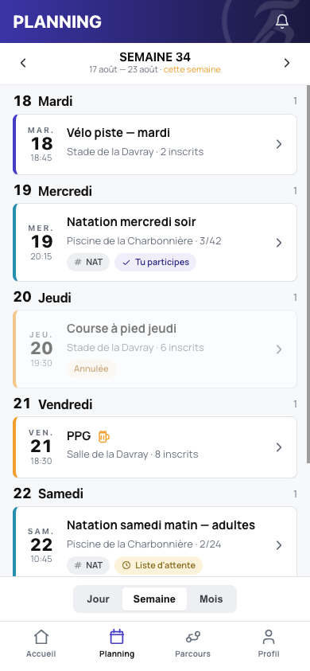

La semaine, jour par jour. Chaque séance affiche son lieu et son remplissage, et l'état se lit sans
ouvrir la fiche : **« Tu participes »**, **« Liste d'attente »**, **« Annulée »**. Les vues *Jour*,
*Semaine* et *Mois* se basculent en bas d'écran.

### La fiche de séance

| Infos | Encadrement | Parcours |
|---|---|---|
| 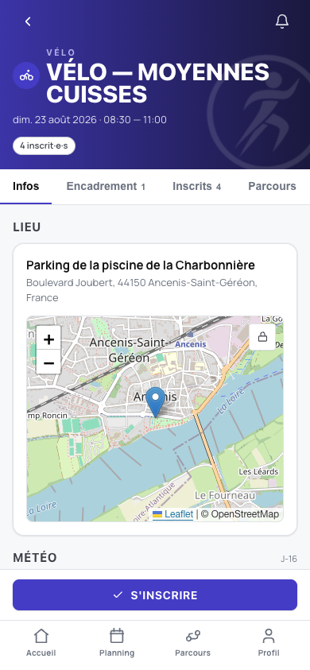 | 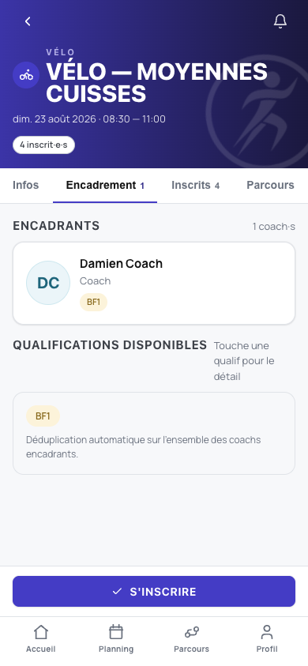 | 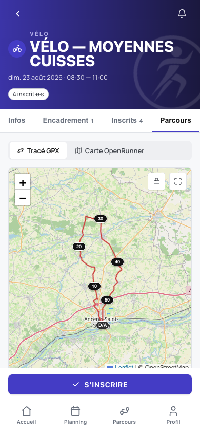 |
| Le point de rendez-vous **sur une carte** (adresse géocodée, fond OpenStreetMap) et la **météo prévue** pour l'heure de la séance. | Qui encadre, et avec quelles **qualifications** (BF1, BNSSA…) — dédupliquées sur l'ensemble des coachs. | Le **tracé GPX** avec ses bornes kilométriques et son profil altimétrique. C'est l'onglet ouvert par défaut quand la séance a un parcours. |

### La tutelle parentale

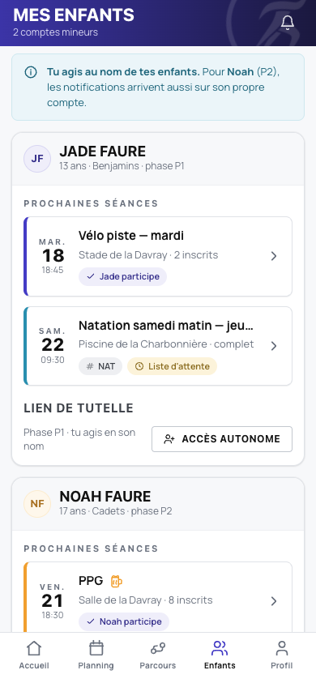

Un parent gère ses enfants **depuis son propre compte**, et les deux niveaux d'autonomie coexistent :

- **Jade**, 13 ans, *phase P1* — pas de compte à elle. Sa mère l'inscrit et reçoit **seule** ses
  notifications.
- **Noah**, 17 ans, *phase P2* — il a son compte. Les notifications arrivent **aussi** sur le sien,
  ce que le bandeau bleu rappelle explicitement.

Le bouton **« Accès autonome »** fait passer un enfant de P1 à P2 le jour où c'est pertinent.

---

## Côté coach

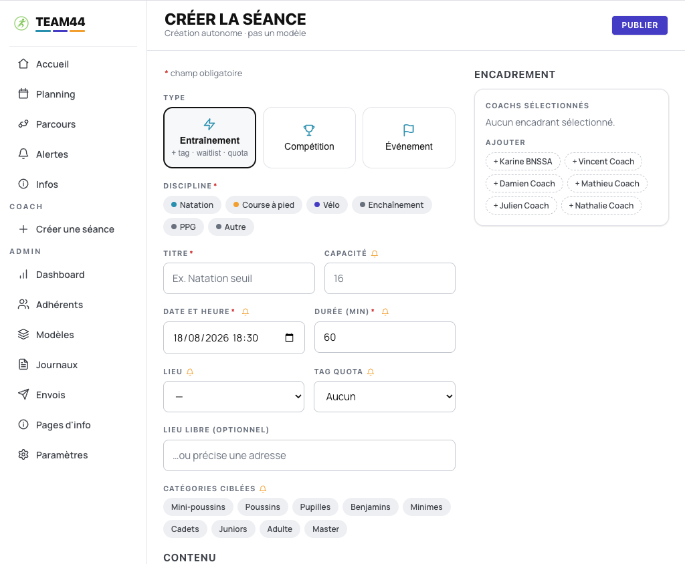

Un coach crée une séance sans passer par l'administration. Le formulaire porte les règles du modèle :
**type** (entraînement, compétition, événement), **discipline**, **capacité**, **tag de quota**, et
**catégories ciblées** — seuls les adhérents de ces catégories pourront s'inscrire. L'encadrement se
compose à droite, à partir des coachs du club.

---

## Côté bureau (administration)

### Tableau de bord

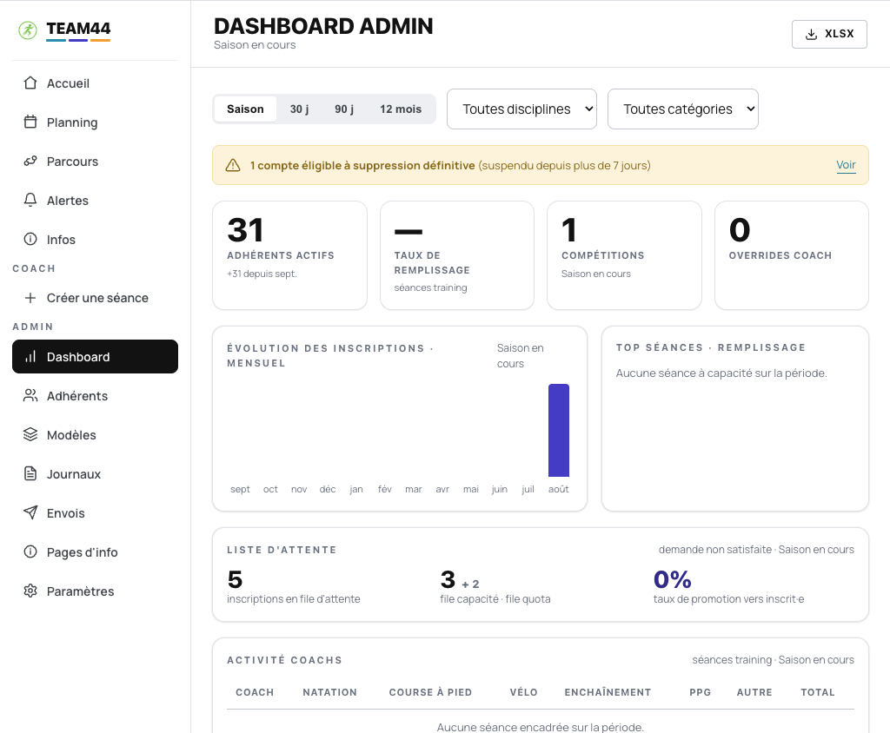

L'état du club en un écran : adhérents actifs, taux de remplissage, évolution des inscriptions sur la
saison, et surtout les **statistiques de liste d'attente** — combien de demandes non satisfaites,
combien promues. Export **XLSX** en haut à droite. La bannière signale ici un compte *éligible à
suppression définitive* (RGPD, suspendu depuis plus de 7 jours).

### Adhérents

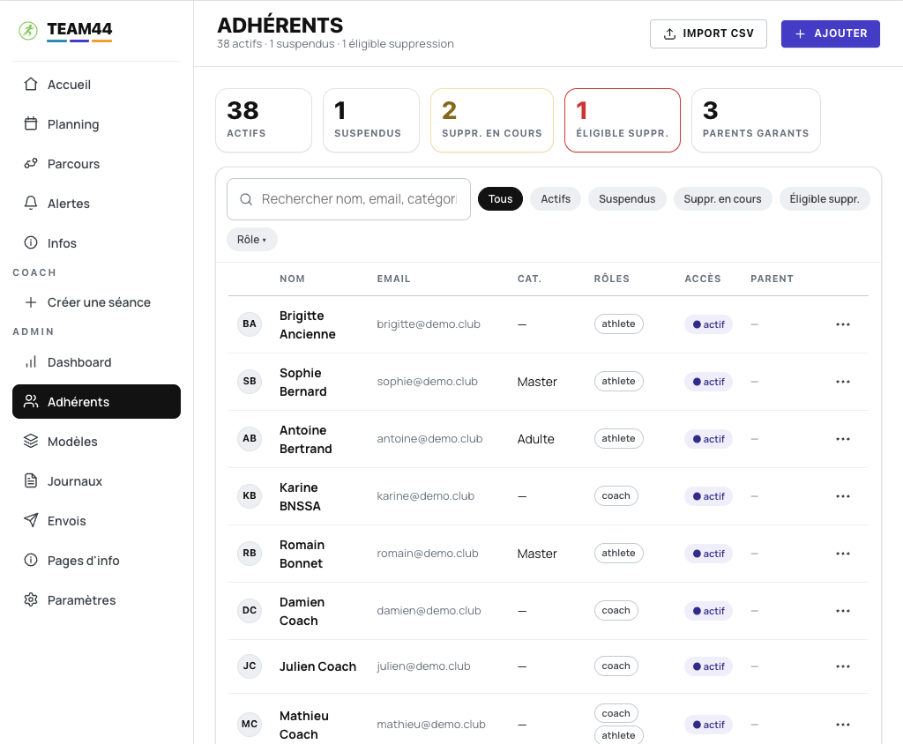

Le fichier du club, avec ses compteurs par statut et ses filtres. Les **rôles se cumulent** (Mathieu
est coach *et* athlète), et la colonne *Parent* relie un mineur à son garant. Import **CSV** pour
démarrer une saison sans ressaisie.

### Modèles de génération

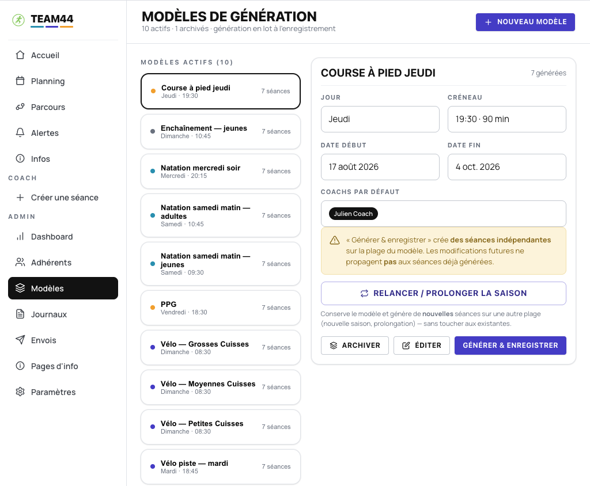

La réponse à « recréer la semaine type chaque saison ». Un modèle décrit un créneau récurrent (jour,
heure, durée, coachs par défaut) et **génère des séances indépendantes** sur une plage de dates.

> L'encadré jaune dit l'essentiel : les séances générées sont **indépendantes du modèle**. Modifier
> le modèle ensuite ne touche pas aux séances déjà créées — c'est délibéré, et documenté à l'écran.

**« Relancer / prolonger la saison »** génère de nouvelles séances sur une autre plage sans toucher
aux existantes.

### Envois sortants

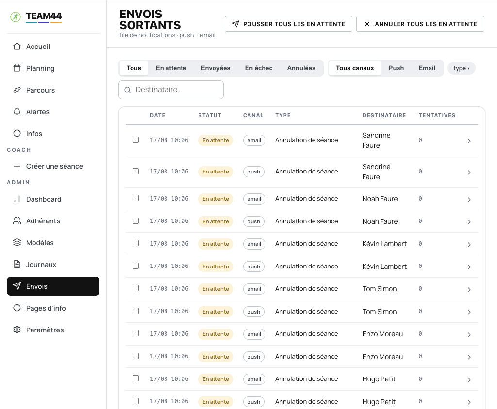

La file des notifications, **une ligne par destinataire et par canal** (email *et* push). Statut,
tentatives, filtres par canal et par type. Le bureau voit ce qui est parti, ce qui attend et ce qui a
échoué — et peut relancer ou annuler en lot.

> Sur la démo, tout reste « En attente » : l'instance ne peut **rien** envoyer, c'est verrouillé
> côté serveur.

### Journaux d'audit

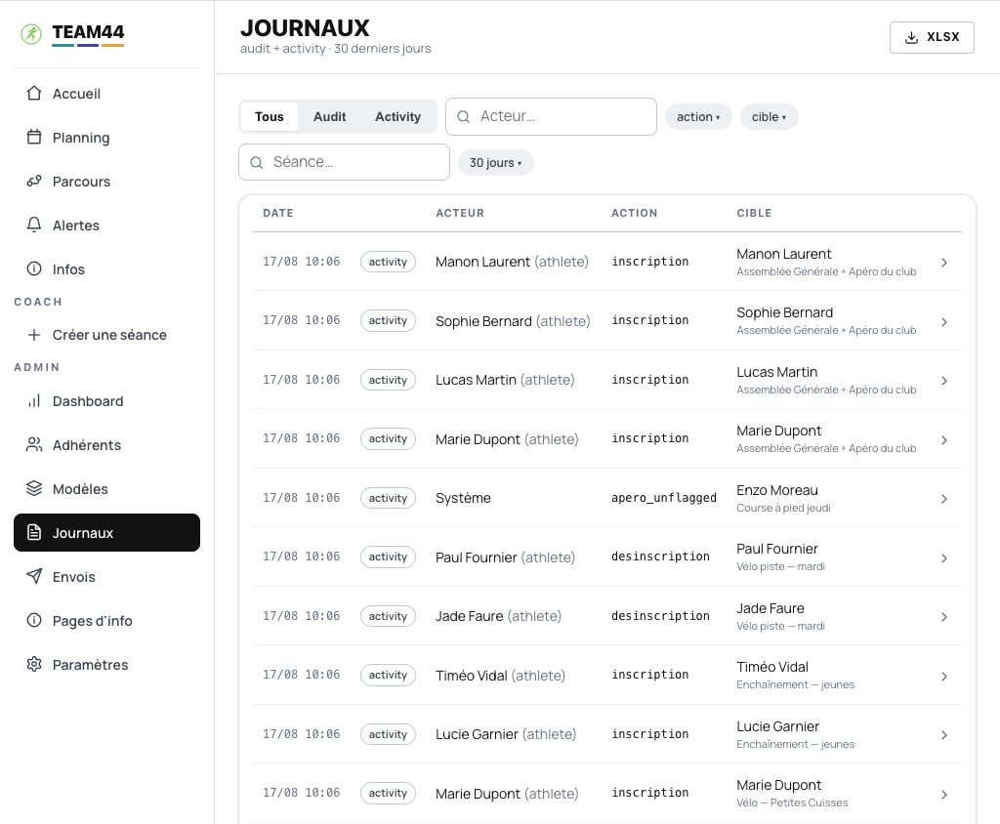

Qui a fait quoi, quand, sur quoi. Deux registres cohabitent : **`audit`** (les actes
d'administration) et **`activity`** (la vie du planning — inscriptions, désinscriptions), filtrables
séparément, par acteur, par action ou par séance. Le **`Système`** y figure comme acteur à part
entière : les décisions automatiques sont traçables au même titre que les gestes humains.

Les traces survivent à la suppression du compte concerné (anonymisation *tombstone*), ce qu'impose la
tenue d'un registre sérieux. Export **XLSX** disponible.

### Pages d'information

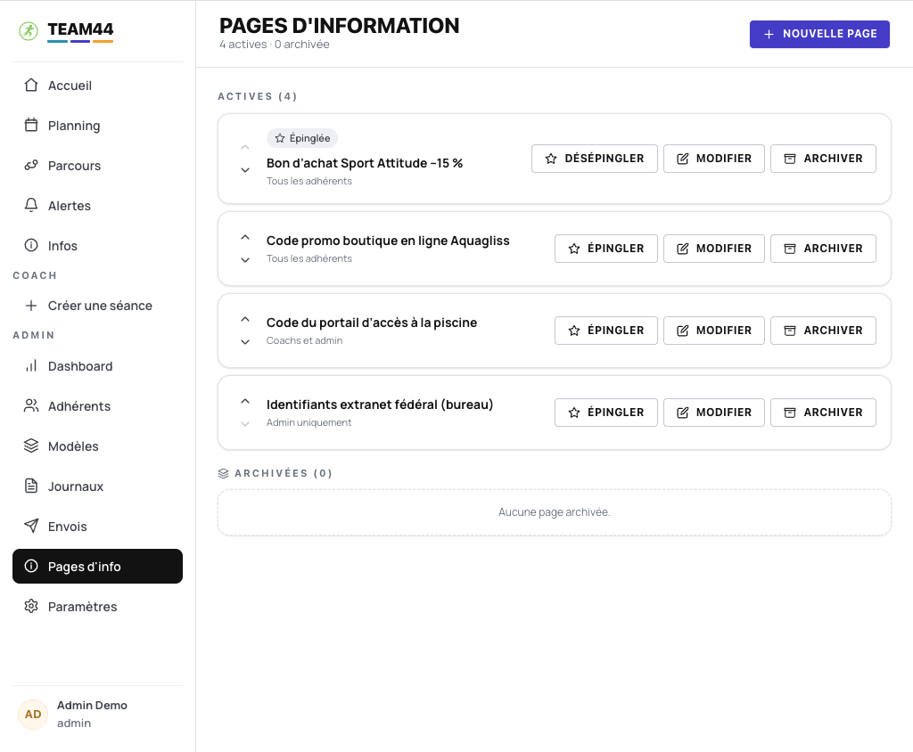

Les pages libres du club — codes d'accès, bons partenaires, informations pratiques. Chacune porte sa
**visibilité** : *Tous les adhérents*, *Coachs et admin*, ou *Admin uniquement*. Le code du portail
de la piscine n'a pas à circuler au-delà des encadrants ; les identifiants de l'extranet fédéral
restent au bureau.

Les pages s'**épinglent** (la première remonte alors en tête d'accueil), se réordonnent, et
s'**archivent** plutôt que de se supprimer.

### Paramètres du club

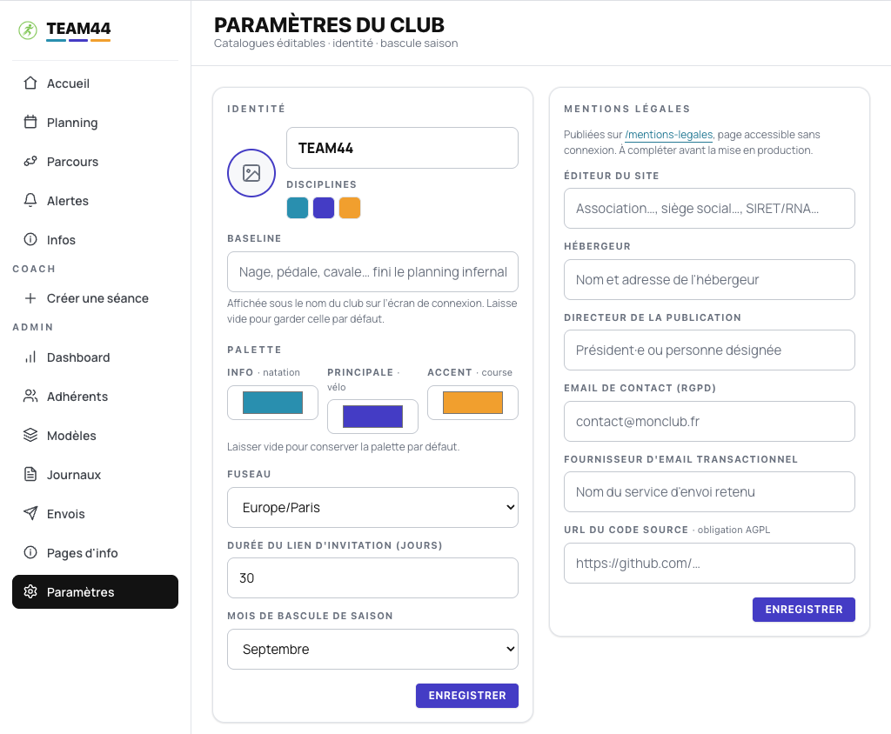

**C'est le club de l'utilisateur, pas le nôtre.** Nom, logo, baseline, les trois couleurs de la
palette, fuseau horaire et mois de bascule de saison se règlent ici — **sans toucher au code**, donc
sans rien perdre au prochain `git pull`.

À droite, les **mentions légales** : éditeur du site, hébergeur, directeur de la publication, contact
RGPD… Elles alimentent la page publique `/mentions-legales`, et le champ *URL du code source* est là
pour l'obligation AGPL — un club qui déploie doit pouvoir dire où trouver les sources.

---

> 📖 Retour au [README](../README.md) · Comptes et scénarios de la démo dans
> [COMPTES_DEMO.md](COMPTES_DEMO.md)
